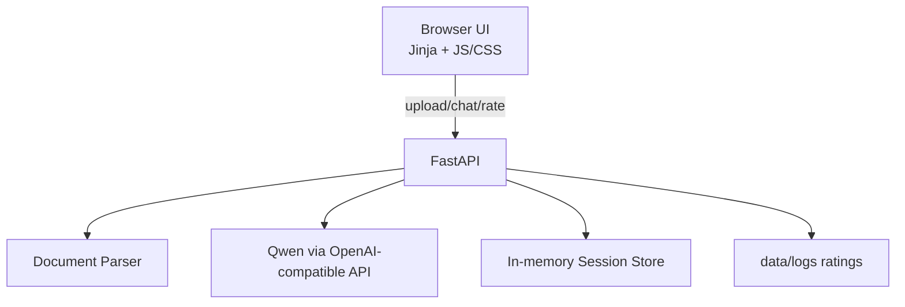

## Architect — ARCHITECTURE
**Дата/время:** 2026-01-21 12:10  
**Фаза:** Архитектура

**Кратко:** Выбран стек FastAPI + Jinja2 + Vanilla JS (Python-first), реализован чат-интерфейс, обработка документов, интеграция с OpenAI-совместимым LLM, серверное логирование рейтингов.

### Выбранный стек
- **Backend/UI**: FastAPI + Jinja2 + Static assets (JS/CSS)
- **LLM**: OpenAI Python SDK, base_url из `OPENAI_SERVER`
- **Парсинг документов**: `mammoth` (DOCX), `pypdf` (PDF), `openpyxl` (XLSX), plain text (MD)
- **Тесты**: pytest + Playwright
- **Docker**: Dockerfile + docker-compose

### Обоснование
Python-first выполнение требований, быстрый прототип с простым UI, минимальная сложность деплоя, возможность кастомизации UI через CSS/JS без отдельного фронтенд-сборщика.

### Компоненты и взаимодействие

### Основные модули
- `src/app.py` — точки входа FastAPI, роуты UI и API.
- `src/services/document_parser.py` — извлечение текста и разметка по страницам.
- `src/services/llm_client.py` — запросы к Qwen через OpenAI SDK.
- `src/services/session_store.py` — хранение документов по `session_id`.
- `src/services/rating_logger.py` — серверное логирование рейтингов.
- `src/ui/templates/index.html`, `src/ui/static/*` — фронтенд.

### API (основные)
- `POST /api/upload` — загрузка 1–5 документов, возвращает список документов.
- `POST /api/chat` — запрос в LLM с режимом детализации и контекстом документов.
- `POST /api/rating` — запись рейтинга с IP.
- `POST /api/prompt/improve` — улучшение промта для кнопки.
- `GET /api/role-defaults` — дефолтные проверки по роли (если будет выведено на сервер).

### Данные и хранение
- `localStorage`: роль, кастомные проверки, `session_id`.
- Сервер: лог рейтингов (`data/logs/ratings.jsonl`), временные файлы в `data/uploads/`.

### Ограничения
- Кастомные проверки локальные (без шаринга).
- История анализа хранится только в памяти сервера.
- Plain text ответы без форматирования.

**Следующие шаги:**
- Реализовать код и UI.
- Добавить тесты и Docker.

**Вопросы/блокеры:** нет
